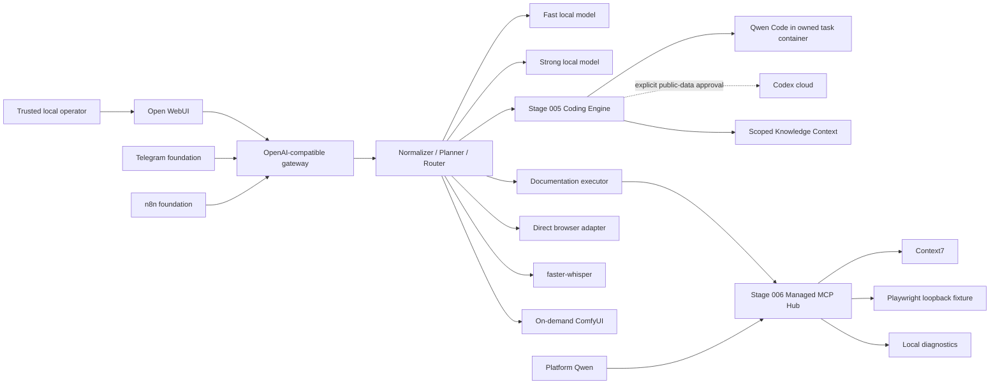

# Current Architecture

Status: factual public snapshot after verified Stages 000–006.

Locestra targets one trusted operator on a local workstation. Local execution
is the default; cloud execution is a separate, explicit data boundary.

## Runtime flow

## Stable external boundaries

| Boundary | Contract |
|---|---|
| Main UI | Open WebUI on loopback port 3737 |
| Model API | OpenAI-compatible gateway on host IPv4 port 8787; bearer required for `/v1/*` |
| Public model name | `local-agent-auto` |
| Voice compatibility | OpenAI-compatible transcription on host IPv4 port 8788; the same bearer is required for `/v1/*` |
| Automation foundation | n8n on loopback port 5678 |
| Local models | Separate fast and strong Ollama profiles |
| Image foundation | ComfyUI on loopback port 8388 when started on demand |

Ports and reference profiles are mutable facts recorded in
[System Manifest](../SYSTEM_MANIFEST.md), not an invitation to expose services
publicly.

## Control-plane responsibilities

The gateway authenticates `/v1`, normalizes a request, creates a deterministic
plan, evaluates policy/capability state, selects an executor, records structured
attempts, and returns OpenAI-compatible success or typed failure.

The router never treats tool availability as permission. Optional capability
failure degrades only the dependent route.

## Coding boundary

Production `local_code` enters the [Coding Engine](CODING_ENGINE.md). The engine
resolves and snapshots the source repository, creates an owned external linked
worktree, builds bounded context, runs Qwen in a task container, verifies the
result in evaluated verifier containers, obtains independent review, and can
create a local commit only when explicitly permitted. The source checkout is
not mutated as task scratch space.

Codex is not an automatic quality fallback. Only explicitly approved public
data may cross that cloud boundary; otherwise a local resumable handoff is
created.

## MCP boundary

The [MCP Hub](MCP_HUB.md) owns only three evaluated integrations: Context7,
loopback Playwright fixture navigation, and local diagnostics. It generates
project-scoped consumer views, manages lazy process lifecycle, enforces minimal
tool schemas and egress policy, and records payload-free audit metadata.

Coding Qwen remains MCP-free. Native filesystem/terminal/Git adapters are not
duplicated as MCP. A Hub outage does not make chat or coding unavailable.

## Storage separation

| Store | Responsibility |
|---|---|
| Task journal | Core routing/execution snapshot |
| Memory database | Typed user/project/task/operational records |
| Knowledge database | Rebuildable sources, generations, fragments, maps, provenance |
| Coding database/runtime registry | Coding task events, artifacts, owned worktrees and recovery |
| MCP runtime registry/log | Generated views, owners, health/circuit state, metadata-only audit |

All runtime stores, logs, generated settings, artifacts, models, and task
worktrees are ignored by Git. Tracked documentation is not a secret store.

## Trust boundaries

- Repository and web content are untrusted data, never instructions that expand
  permissions.
- Context7 is external public-documentation egress.
- Codex is an explicit cloud boundary.
- Playwright MCP is loopback-fixture-only; the direct browser adapter owns
  public browsing policy.
- Docker/container isolation reduces authority but does not remove trust in the
  host, daemon, filesystem, Git, model server, or pinned upstream images.
- The platform remains single-user and requires local network/firewall hygiene.

## Planned expansion

Stage 007 will unify tool/application metadata above native and MCP adapters.
Stages 008–010 harden voice, image, and interface jobs. Stage 011 adds controlled
improvement. The initial routing EvalKit is published, while the broader
Stage 012 cross-capability evaluation program remains planned.
