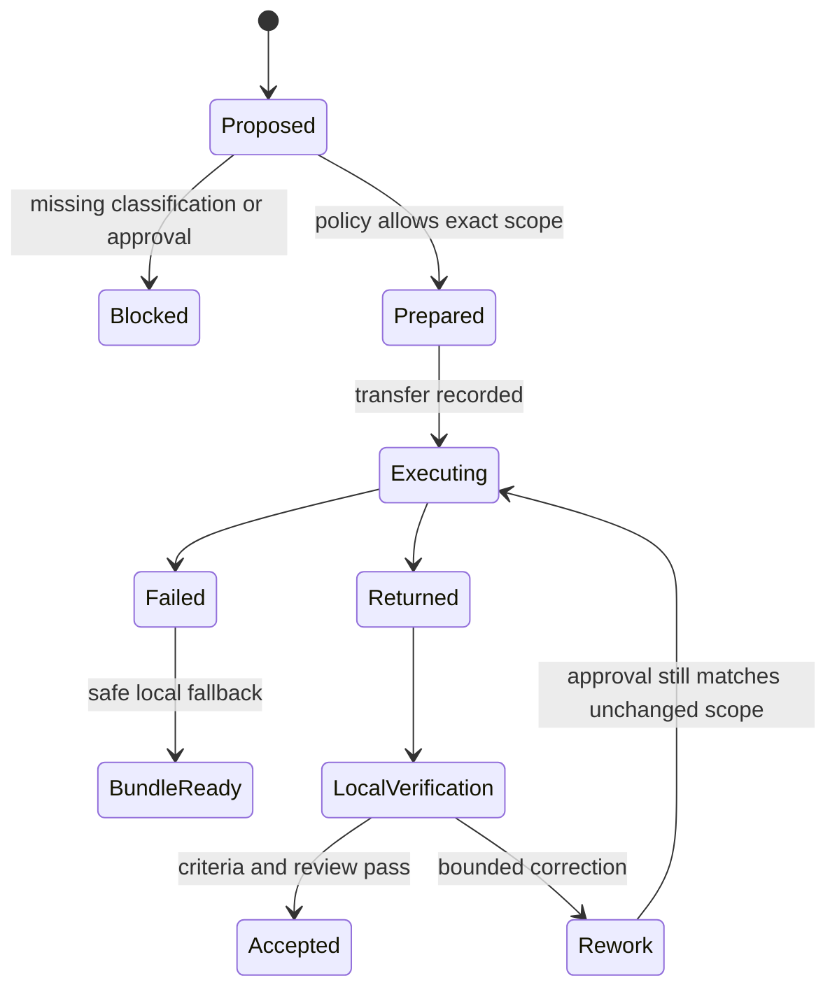

# Контракт local ↔ Codex

- Статус: Stage 005 implements a strict public-data-only Codex execution,
  review, handoff, and resume boundary; a general private-data approval ledger
  remains incomplete.
- Владелец: Execution Engine и permission policy; пользователь владеет approval.
- Граница: Codex CLI запускается локально, но model inference и переданные данные являются cloud processing.
- Правила: [Permissions](PERMISSIONS.md), [Privacy](../constitution/PRIVACY.md) и [ADR 0002](adr/0002-local-first-and-codex-boundary.md).

## Когда допустим handoff

Codex применяется к сложному coding/review, когда локальный путь недостаточен или policy выбирает cloud executor. Capability flag/login не являются approval. Public/non-sensitive fixture может быть разрешён заранее scoped policy; private/sensitive workspace требует явного разрешения на конкретные данные. Secret запрещён всегда.

The Stage 005 Coding Engine invokes Codex only when both scoped cloud permission
and `public` classification are present. Otherwise it creates a local,
versioned resumable handoff. Private/sensitive repositories are not sent to
Codex by this contract. Capability flags, installed CLI state, and credentials
do not grant approval.

## Handoff envelope v1

| Поле | Требование |
|---|---|
| Identity | request/task/correlation IDs и contract version |
| Goal | исходная цель без потери ограничений |
| Workspace | canonical project, Git root, commit, branch/worktree и dirty-state ownership |
| Data scope | classification, разрешённые файлы/chunks/hashes и явные исключения |
| Permissions | read-only/modify, запрещённые действия, sandbox и approval reference/expiry |
| Acceptance | критерии готовности и verification plan |
| Context | bounded project map, relevant excerpts, provenance и invalidation state |
| Evidence | выполненные локальные проверки, diff/artifact references и точные failures |
| Return contract | ожидаемый result/diff/review format и запрет push/deploy/commit, если не разрешено |

Bundle не содержит большие binaries, бесконечные логи, credentials или весь репозиторий. Файлы передаются только по allowlist и минимальному scope.

## Lifecycle

Изменение workspace, diff, recipient/model service, data classification или approval expiry возвращает handoff в `Proposed`.

## Exec и review

- Review использует read-only sandbox и возвращает findings с severity, file/line и scenario. Он не исправляет файлы.
- Exec может изменять только approved workspace и не создаёт commit/push без отдельного разрешения.
- `review and fix` является exec-задачей и требует writable scope.
- Ответ Codex считается недоверенным до локального diff/test/reviewer.

## Return и проверка

The Coding Engine records executor/model, attempts, timestamps, returned
artifact hashes, findings, and unresolved errors in its separate versioned
state. The local side revalidates project/worktree identity, rules, current
diff/status/fingerprint, artifact hashes, tests, review, and acceptance
criteria. The text “done” without evidence cannot close a task.

## Failure и cleanup

Timeout, cancellation, CLI failure, or denied cloud permission cannot become
success. A versioned handoff may remain ready, but resume revalidates the same
owned worktree and all evidence. Generated handoff/result artifacts stay in
ignored task storage and require the operator's retention policy.
