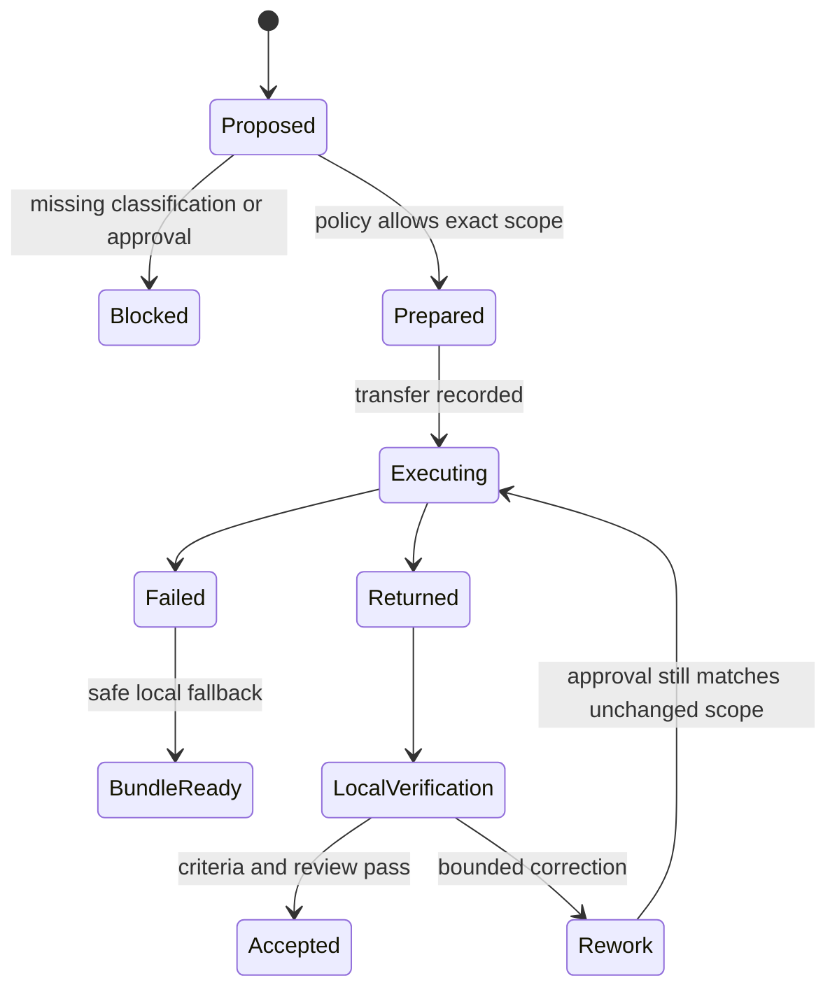

# Контракт local ↔ Codex

- Статус: архитектурный контракт; текущий automatic cloud enforcement неполный.
- Владелец: Execution Engine и permission policy; пользователь владеет approval.
- Граница: Codex CLI запускается локально, но model inference и переданные данные являются cloud processing.
- Правила: [Permissions](PERMISSIONS.md), [Privacy](../constitution/PRIVACY.md) и [ADR 0002](adr/0002-local-first-and-codex-boundary.md).

## Когда допустим handoff

Codex применяется к сложному coding/review, когда локальный путь недостаточен или policy выбирает cloud executor. Capability flag/login не являются approval. Public/non-sensitive fixture может быть разрешён заранее scoped policy; private/sensitive workspace требует явного разрешения на конкретные данные. Secret запрещён всегда.

Текущий gateway создаёт Markdown bundle и при включённом `ENABLE_CODEX_EXEC` может автоматически запустить Codex. Data classification, approval ledger и transfer provenance ещё не enforced, поэтому этот path остаётся известным security gap и не должен использоваться для private/sensitive code без явного разрешения владельца.

## Handoff envelope v1

| Поле | Требование |
|---|---|
| Identity | request/task/correlation IDs и contract version |
| Goal | исходная цель без потери ограничений |
| Workspace | canonical project, Git root, commit, branch/worktree и dirty-state ownership |
| Data scope | classification, разрешённые файлы/chunks/hashes и явные исключения |
| Permissions | read-only/modify, запрещённые действия, sandbox и approval reference/expiry |
| Acceptance | критерии готовности и verification plan |
| Context | bounded project map, relevant excerpts, provenance и invalidation state |
| Evidence | выполненные локальные проверки, diff/artifact references и точные failures |
| Return contract | ожидаемый result/diff/review format и запрет push/deploy/commit, если не разрешено |

Bundle не содержит большие binaries, бесконечные логи, credentials или весь репозиторий. Файлы передаются только по allowlist и минимальному scope.

## Lifecycle

Изменение workspace, diff, recipient/model service, data classification или approval expiry возвращает handoff в `Proposed`.

## Exec и review

- Review использует read-only sandbox и возвращает findings с severity, file/line и scenario. Он не исправляет файлы.
- Exec может изменять только approved workspace и не создаёт commit/push без отдельного разрешения.
- `review and fix` является exec-задачей и требует writable scope.
- Ответ Codex считается недоверенным до локального diff/test/reviewer.

## Return и проверка

Целевой Execution Engine обязан сохранять executor/model/profile, started/finished time, exit code, returned artifact hashes и unresolved errors. Текущий gateway сохраняет только bounded `TaskStateV1` snapshot (status, attempts, executor, project/worktree, timestamps, generic unresolved error) плюс legacy raw result/metadata; полного return-evidence contract ещё нет. Локальная сторона заново проверяет project path, diff ownership, secret scan, relevant tests и acceptance criteria. Текст «готово» без artifacts не закрывает задачу.

## Failure и cleanup

Timeout, CLI failure или запрет cloud не теряют задачу: создаётся `BundleReady`, но это не success. Временный last-message файл должен быть удалён после чтения; bundle/result retention управляется Artifact Store. Текущий runtime оставляет такие файлы и raw bundles без общего TTL — это долг, а не часть целевого контракта.
